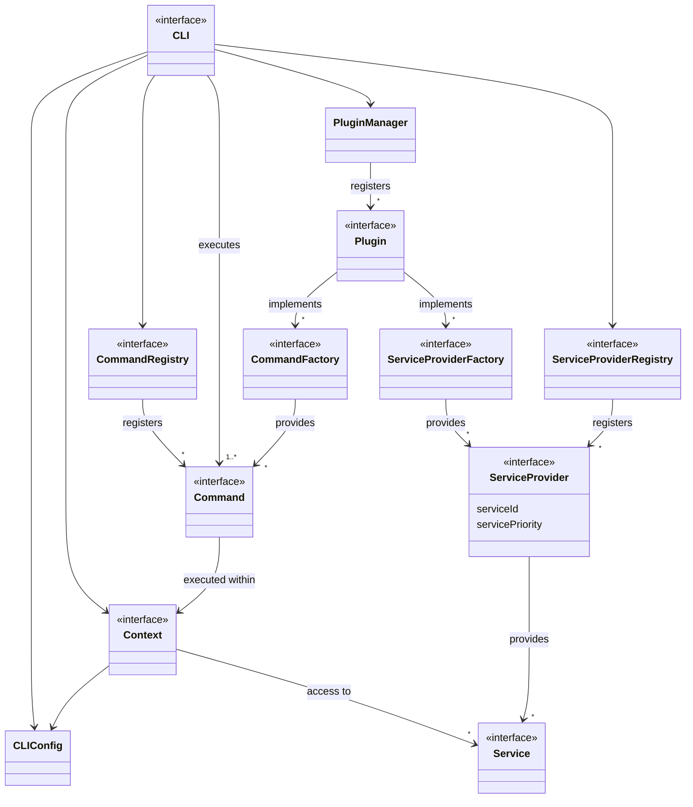
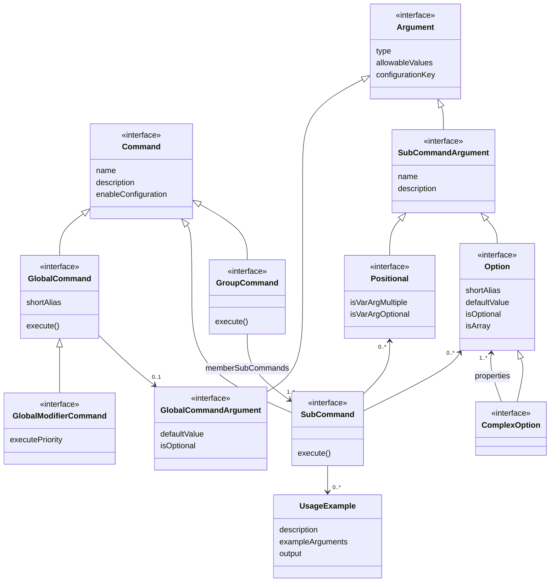
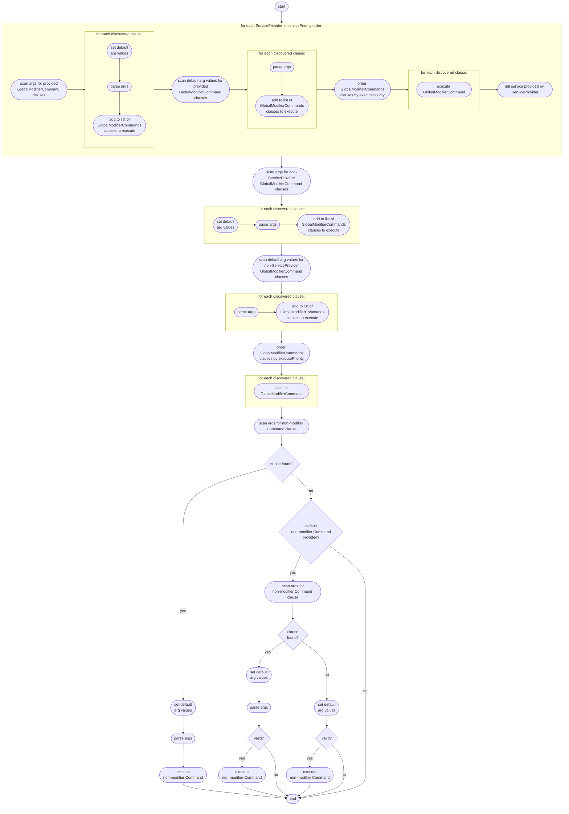
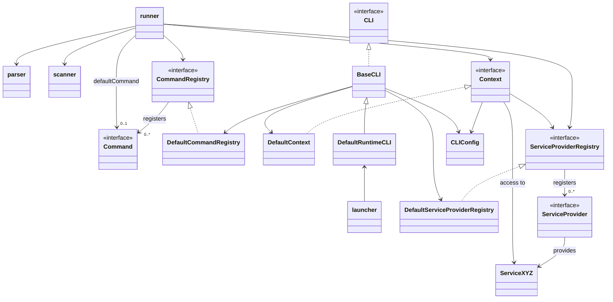

# dynamic-cli-framework

[](https://github.com/flowscripter/dynamic-cli-framework/releases)
[](https://github.com/flowscripter/dynamic-cli-framework/actions/workflows/release-bun-library.yml)
[](https://codecov.io/gh/flowscripter/dynamic-cli-framework)
[](https://flowscripter.github.io/dynamic-cli-framework/index.html)
[](https://github.com/flowscripter/dynamic-cli-framework/blob/main/LICENSE)

> A framework for developing CLI applications which supports dynamic discovery
> and installation of new commands

[//]: # (TODO: Remove this when plugin support and compiled binaries available.)

NOTE: The dynamic aspect is still in development as it relies upon:

- some outstanding work on the
  [dynamic-plugin-framework](https://github.com/flowscripter/dynamic-plugin-framework)
  dependency.

So it isn't really dynamic at the moment! 😜

## Key Features

- Flexible CLI definitions:
  - a single default global command with global arguments e.g.
    `executable [global_arguments]`
  - multiple sub-commands with sub-command based arguments e.g.
    `executable <sub_command> [sub_command_arguments]`
  - multiple grouped member sub-commands with member sub-command based arguments
    e.g.
    `executable <group_command> <member_sub_command> [member_sub_command_arguments]`
  - A mix of the above!
- Support for both named option and position based arguments e.g.
  `executable --<option_name>=<option_value> <positional_value>`
- Support for specifying multiple values for:
  - named options arguments via either:
    - implicitly indexed repeated arguments e.g.
      `executable --<option_name>=<option_value_1> --<option_name>=<option_value_2>`
    - or explicitly indexed arguments e.g.
      `executable --<option_name>[0]=<option_value_1> --<option_name>[1]=<option_value_2>`
  - position based arguments ("varargs") e.g.
    `executable <positional_1_value_1> <positional_1_value_2>`
- Support for complex nested options e.g.
  `executable --<option_name>.<property_1_name>=<property_1_value> --<option_name>.<property_1>.<property_1_a>=<property_1_a_value>`
- Support (optional) for persisted configuration and environment variables to
  specify command argument defaults.
- Core (but optional) commands for help, logging level and version management.
- Core (but optional) services for color output to stdout/stderr and
  configuration management.
- Core (but optional) support for dynamic discovery and installation of commands
  and services using
  [dynamic-plugin-framework](https://github.com/flowscripter/dynamic-plugin-framework)
- Minimal dependencies.
- Bun based.
- Based on native JavaScript modules.
- Written in Typescript.
- Compiled to a binary executable using a Bun runtime.

## Usage Examples

The following example projects are available:

- [example-cli](https://github.com/flowscripter/example-cli) is an example CLI
  application based on this framework.

[//]: # (TODO: Add this when implemented.)
[//]: # (- [example-cli-plugin]&#40;https://github.com/flowscripter/example-cli-plugin&#41; is an)
[//]: # (  example command and service plugin based on this framework.)
[//]: # (TODO: Add this when implemented.)
[//]: # (- [sdl-tool]&#40;https://github.com/flowscripter/sdl-tool&#41; is a real world use case CLI)
[//]: # (  application based on this framework.)

## Key Concepts

The key concepts are:

- Specific command functionality is implemented within one or more `Command`
  instances.
- Generic support functionality is implemented within or or more `Service`
  instances.
- The `CLI` is responsible for:
  - maintaining a `CommandRegistry` and ensuring the `Command` instances it has
    registered are available when scanning and parsing arguments and executing
    specified commands.
  - maintaining a `ServiceProviderRegistry` and ensuring that services provided
    by each of the registered `ServiceProvider` instances are available for use
    by any invoked `Command` via a a `Context`.
- Dynamic plugins (enabled by
  [dynamic-plugin-framework](https://github.com/flowscripter/dynamic-plugin-framework))
  allow:
  - dynamic load and import of one or more `CommandFactory` implementations
    providing one or more `Command` implementations.
  - dynamic load and import of one or more `ServiceProviderFactory`
    implementations providing one or more `ServiceProvider` implementations.

The following high-level conceptual diagram illustrates these relationships:



### Commands

A `Command` declares:

- a `name` which is to be used in command line arguments to invoke it.
- a function `execute()` which is invoked if the command is specified. This
  function is invoked with the parsed arguments and a context.
- an optional declaration of arguments it supports.

The sub-types of command are: `GlobalCommand`, `GlobalModifierCommand`,
`SubCommand` and `GroupCommand`.

The following high-level conceptual diagram illustrates the Command API:



#### Global Command

A `GlobalCommand` provides the ability to invoke functionality via a global
argument and one optional value:

    executable --<global_command>[=<value>]

A concrete example:

    myNetworkApp --help=connect

A `GlobalCommand` also supports a short character alias:

    executable -<global_command_short_alias>[=<value>]

A concrete example:

    myNetworkApp -h=connect

#### Global Modifier Commands

Any number of `GlobalModifierCommand` instances can be specified as long as they
are accompanied by a `GlobalCommand` or a `SubCommand`:

    executable --<global_modifier_command_1>[=<global_modifier_command_1_argument>] \
               --<global_modifier_command_2>[=<global_modifier_command_2_argument>] \
               <global_command>[=<value>]

Each `GlobalModifierCommand` will be executed before the single specified
`GlobalCommand` or `SubCommand` is executed. This behaviour allows
`GlobalModifierCommands` to modify the context in which later commands execute.

A `GlobalModifierCommand` defines an "execution priority" which is used to
determine the order of execution when multiple `GlobalModifierCommands` are
specified.

A concrete example:

    myNetworkApp --log-level=DEBUG --config=./config.json --help

where:

- `log-level` is a `GlobalModifierCommand` with a value of `DEBUG`
- `config` is a `GlobalModifierCommand` with a value of `./config.json`
- `help` is a `GlobalCommand`.

#### Sub-Command

A `SubCommand` provides the ability to invoke functionality via specifying the
command name followed by any number of option and positional arguments.

A sub-command is invoked as follows:

    executable <sub_command> [sub_command_arguments]

A concrete example:

    myNetworkApp serve --host=localhost

#### Group Command

A `GroupCommand` allows multiple member `SubCommand` instances to be grouped
under a single named group. The name of the `GroupCommand` is specified before
the desired member `SubCommand` in one of two ways:

    executable <group_command> <member_sub_command> [member_sub_command_arguments]
    executable <group_command>:<member_sub_command> [member_sub_command_arguments]

Some concrete examples:

    myNetworkApp utils ping --host=localhost
    myNetworkApp utils:ping --host=localhost

**NOTE**: A `GroupCommand` also provides for it's own logic to be invoked BEFORE
the specified sub-command. However, a `GroupCommand` does not support any
arguments itself.

### Arguments

#### Global Command and Global Modifier Command Arguments

`GlobalCommand` and `GlobalModifierCommand` instances support the definition of
a single `GlobalCommandArgument` consisting of:

- a type: `NUMBER`, `INTEGER`, `BOOLEAN`, `STRING` or `SECRET`.
- an optional set of allowable values.
- an optional default value.
- whether the value is mandatory.

There are four ways in which these argument values can be specified:

    executable --<global_command>=<value>
    executable --<global_command> <value>
    executable -<global_command_short_alias>=<value>
    executable -<global_command_short_alias> <value>

Some concrete examples:

    myNetworkApp --help=connect
    myNetworkApp --help connect
    myNetworkApp -h=connect
    myNetworkApp -h connect

###### Boolean Values

For boolean options, specifying the value as `true` is not required. All of the
following set the value to `true`:

    executable --<global_command>=true
    executable --<global_command> true
    executable --<global_command>
    executable -<global_command_short_alias>=true
    executable -<global_command_short_alias> true
    executable -<global_command_short_alias>

#### Sub-Command Arguments

Arguments for a `SubCommand` can take two forms: `Option` or `Positional`.

Common to both are the following features:

- a name which must consist of alphanumeric non-whitespace ASCII characters or
  `_` and `-` characters. It cannot start with `-`.
- a type: `NUMBER`, `INTEGER`, `BOOLEAN`, `STRING` or `SECRET`.
- an optional set of valid value choices.

##### Options

An `option` argument also provides for:

- a short character alias for the option.
- whether the option is mandatory.
- an optional default value.
- whether the option can be specified more than once (i.e. it is an array value)
- an additional type: `COMPLEX` which allows for nested arguments

There are four ways in which options can be specified:

    executable <sub_command> --<option_name>=<value>
    executable <sub_command> --<option_name> <value>
    executable <sub_command> -<option_short_alias>=<value>
    executable <sub_command> -<option_short_alias> <value>

###### Boolean Values

For boolean options, specifying the value as `true` is not required. All of the
following set the value to `true`:

    executable <sub_command> --<boolean_option_name>=true
    executable <sub_command> --<boolean_option_name> true
    executable <sub_command> --<boolean_option_name>
    executable <sub_command> -<boolean_option_short_alias>=true
    executable <sub_command> -<boolean_option_short_alias> true
    executable <sub_command> -<boolean_option_short_alias>

###### Array Options

For array options, multiple values can be specified using explicit indices:

    executable <sub_command> --<array_option_name>[index]=value --<array_option_name>[index]=value

or with implicit indices:

    executable <sub_command> --<array_option_name>=value --<array_option_name>=value

Some concrete examples:

    myNetworkApp --bind --interface[0]=eth0 --interface[1]=eth1
    myNetworkApp --bind --interface=eth0 --interface=eth1

**NOTE**: When using explicit indices, the indices may be specified in any
order, however specifying a sparse array is not supported:

    myNetworkApp --bind --interface[2]=eth0 --interface[1]=eth1 --interface[0]=eth2
    myNetworkApp --bind --interface[1]=eth0 --interface[2]=eth1 // invalid as index 0 is not specified

**NOTE**: Arrays of arrays are not supported:

    myNetworkApp --bind --interfaces[0][0]=eth0 // invalid as multi-dimensional arrays are not supported

###### Complex Options

For complex options, the path to the desired property is specified using a `.`
separator:

    executable <sub_command> --<parent_option_name>.<property_name>=<value> --<parent_option_name>.<property_name>.<sub-property-name>=<value>
    executable <sub_command> --<parent_option_name>.<property_short_alias>=<value> --<parent_option_short_alias>.<property_name>.<sub-property-name>=<value>

Mixed use of option names and short aliases is supported when specifying nested
complex option properties. If the property specification starts with the root
options's name then `--` must be used; whereas if it starts with the root
option's short alias then `-` must be used. The following are all equivalent:

    --alpha.beta.gamma=1
    --alpha.b.gamma=1
    --alpha.b.g=1
    -a.beta.gamma=1
    -a.beta.g=1
    -a.b.g=1

Implicit and explicit array indexing is supported when specifying nested complex
option properties. However the implicit indexing is only applied to the last
nested property reference. The following are equivalent:

    --foo.bar=1 --foo.bar=2
    --foo.bar[0]=1 --foo.bar[1]=2

If arrays of complex options need to be referenced then explicit indexing is
required. As an example:

    --foo[0].bar=1 --foo[1].bar=2

Some concrete examples:

    myNetworkApp --connect --address.host=127.0.0.1 --address.port=8080
    myNetworkApp --poll --address[0].host=127.0.0.1 --address[0].port=8080 --address[1].host=10.0.10.1 --address[1].port=443

##### Positionals

A `positional` argument is specified by a value which appears at the correct
position in the list of `SubCommand` arguments:

    executable <sub_command_name> <positional_1_value> <positional_2_value>

A concrete example:

    myHelloWorldApp say hello

where:

- `say` is a sub-command.
- `hello` is the value for the first positional argument.

###### Varargs Positionals

A `positional` argument also provides for "varargs" support (both optional and
multiple) which allows for zero, one or more entries:

**NOTE**: Only one "varargs" `positional` can be defined and it must be the last
positional expected for the command.

If "varargs" optional is set for `positional_1`, these are both valid:

    executable <sub_command>
    executable <sub_command> <positional_1_value_1>

If "varargs" multiple is set for `positional_1`, these are both valid:

    executable <sub_command> <positional_1_value_1>
    executable <sub_command> <positional_1_value_1> <positional_1_value_2>

If "varargs" optional AND multiple is set for `positional_1`, these are all
valid:

    executable <sub_command>
    executable <sub_command> <positional_1_value_1>
    executable <sub_command> <positional_1_value_1> <positional_1_value_2> <positional_1_value_3>

### Argument Values

#### Value Types

The supported value types which can be specified for an `Option`, a `Positional`
or `GlobalCommandArgument` are:

- `STRING` - a string value where whitespace can be included by using double
  quotes e.g. `myHelloWorldApp say "hello world"`
- `NUMBER` - any number value such as `0.01` or `-10`
- `INTEGER` - any positive or negative integer value. Note that these values
  will still be stored as a JavaScript number and specification as `INTEGER` is
  only used for validation when parsing arguments.
- `BOOLEAN` - string values of `true`, `TRUE`, `false` and `FALSE` are converted
  to a JavaScript boolean value. Specifying just the argument name is also
  sufficient to indicate a value of `true`.
- `SECRET` - a string value which may be specified as an argument, as a default
  value in a configuration file or (ideally) sourced from an environment
  variable.

[//]: # (TODO: remove when PromptService is implemented: https://github.com/flowscripter/dynamic-cli-framework/issues/10)

**NOTE**: `SECRET` will be more useful as a type when a `PromptService` is
implemented.

#### Default Values

Support for reading default argument values from a configuration file and/or
environment variables is provided by `ConfigurationServiceProvider`.

Usage of configured default values for each `Command` is only enabled if
`Command.enableConfiguration` is `true`.

##### Configuration File

Default values can be stored in a JSON file which contains a top level
`defaults` property. The second level of properties under `defaults` is used to
refer to each `Command` by `Command.name` and the contained values are treated
as command argument values. As an example:

```
{
    "defaults": {
        "subCommand1": {
            "arg1": [
                1,
                2
            ],
            "arg2": {
                "arg3": "foo"
            }
        },
        "subCommand2": {
            "arg4": true
        },
        "globalCommand": "globalArgumentValue"
    }
}
```

The default location of the configuration file is
`$HOME/.<application_name>.json`. If `$HOME` is not defined then no default
configuration will be used. The location of the configuration file can be
modified via the `ConfigCommand` global modifier command.

As a concrete example, the following command line:

`myNetworkApp --connect --address.host=127.0.0.1 --address.port=8080`

is equivalent to specifying default values for the `address.host` and
`address.port` arguments in the configuration file `$HOME/.myNetworkApp.json`:

```
{
    "defaults": {
        "connect": {
            "address.host": "127.0.0.1",
            "address.port": 8080
        }
    }
}
```

and using the command line:

`myNetworkApp --connect`

These defaults can then be overridden on the command line:

`myNetworkApp --connect --address.host=192.168.1.1`

##### Environment Variables

Default values are also sourced from environment variable values. Any values set
by environment variables will override those sourced from a configuration file.
Any values set on the command line override environment variable and
configuration file values.

The optional `Argument.configurationKey` value is a configuration key to use for
the argument. It must consist of alphanumeric non-whitespace uppercase ASCII or
`_` characters and must not start with a digit.

If not specified a default configuration key is determined as follows:

The `Argument.name` is capitalized and any `-` characters are replaced with `_`
characters. If the result starts with a digit, it is prefixed with `_`. Some
examples:

- name: `FooBar` => default configuration key: `FOOBAR`
- name: `Hello-World-` => default configuration key: `HELLO_WORLD_`
- name: `3` => default configuration key: `_3`

**NOTE**: Regardless of whether a `configurationKey` is specified, or the
default is relied upon, it will only be used if the parent `Command` has
`Command.enableConfiguration` specified as `true`.

The full key for an argument (or a nested option in a complex option) is
determined as follows:

- Nested argument configuration keys are concatenated with a `_` separator.
- Any arguments which support array values must by suffixed with `_` and an
  explicit array index.
- If the root argument in the path does not use a custom
  `Argument.configurationKey` then the key path is additionally suffixed with
  the `CLIConfig.name` and the `Command.name` with `_` separators.

This is best explained with examples...

Examples for no custom configuration key:

- executable: `MyCLI`, command: `command1`, simple argument: `arg1` =>
  environment variable: `MYCLI_COMMAND1_ARG1`
- executable: `MyCLI`, command: `command1`, array argument referring to the 1st
  element: `arg2[0]` => environment variable: `MYCLI_COMMAND1_ARG2_0`
- executable: `MyCLI`, command: `command1`, argument name: `3` (this is a digit
  so it is by default suffixed with `_`) => environment variable:
  `MYCLI_COMMAND1__3`
- executable: `MyCLI`, command: `command1`, nested option: `arg1.arg2` =>
  environment variable: `MYCLI_COMMAND1_ARG1_ARG2`
- executable: `MyCLI`, command: `command1`, nested option with both levels being
  arrays and referring to the 2nd element of each: `arg1[1].arg2[1]` =>
  environment variable: `MYCLI_COMMAND1_ARG1_1_ARG2_1`

Examples for custom configuration key at the root level (and therefore not
prefixed with CLI and command names):

- executable: `MyCLI`, command: `command1`, simple argument: `arg1` with
  configuration key: `FOO` => environment variable: `FOO`
- executable: `MyCLI`, command: `command1`, array argument referring to the 1st
  element: `arg2[0]` and with configuration key: `BAR` => environment variable:
  `BAR_0`

Examples for custom configuration key NOT at the root level (and therefore
prefixed with CLI and command names) examples:

- executable: `MyCLI`, command: `command1`, nested option: `arg1.arg2` with
  `arg2` configuration key: `FOO` => environment variable:
  `MYCLI_COMMAND1_ARG1_FOO`
- executable: `MyCLI`, command: `command1`, nested option with both levels being
  arrays and referring to the 2nd element of each: `arg1[1].arg2[1]` and with
  arg2 configuration key: `BAR` => environment variable:
  `MYCLI_COMMAND1_ARG1_1_BAR_1`

As a concrete example, the following command line:

`myNetworkApp --connect --address.host=127.0.0.1 --address.port=8080`

is equivalent to defining the following environment variables:

- `MYNETWORKAPP_CONNECT_ADDRESS_HOST=127.0.0.1`
- `MYNETWORKAPP_CONNECT_ADDRESS_PORT=8080`

and using the command line:

`myNetworkApp --connect`

**NOTE**: For boolean values, defining the environment variable with ANY value
is equivalent to setting it to `true`. All of the following set the value to
`true`:

    NO_COLOR=1
    NO_COLOR=true
    NO_COLOR=false // sets the value to true as the environment variable has a value set!

To specify the value as `false`, set the environment variable to be an empty
string e.g.

    NO_COLOR= // sets the value to false

#### Configured Value Merging

Any configured values are merged with parsed values before being validated based
on their associated argument definitions.

The following logic is applied during merging of configured and parsed values:

**Configured primitive values are used unless overridden by parsed values**

Example:

    configured: { "foo": "bar" }
    parsed:     undefined
    result:     { "foo": "bar1" }

Example:

    configured: { "foo": "bar" }
    parsed:     { "foo": "bar1" }
    result:     { "foo": "bar1" }

**Configured complex values are merged (union of unique property names) or
overridden (replacement of duplicate property names) by parsed values**

Example:

    configured: { "foo": { "a": 1, "b": 2 } }
    parsed:     { "foo": { "a": 3, "c": 4 } }
    result:     { "foo": { "a": 1, "b": 2, "c": 4 } }

**Configured array values are merged (for unique indices) or overridden
(replacement of duplicate indices) by parsed values**

Example:

    configured: { "foo": [ 0, 1, 2, 3 ] }
    parsed:     { "foo": [ 0, 4, 2 ] }
    result:     { "foo": [ 0, 4, 2, 3 ] }

Example:

    configured: { "foo": [ 0, 1, 2, 3 ] }
    parsed:     { "foo": [ 0, undefined, 2 ] }
    result:     { "foo": [ 0, 4, 2, 3 ] }

Example:

    configured: { "foo": [ { "a": 1 }, { "a": 2 }, { "a": 3 }, { "a": 4 } ] }
    parsed:     { "foo": [ { "a": 5 }, undefined, { "a": 6, "b": 7 } ] }
    result:     { "foo": [ { "a": 5 }, { "a": 2 }, { "a": 6, "b": 7 }, { "a": 4 } ] }

#### 

### Value Validation

After parsing of specified arguments, merging with configured defaults and
assigning values to relevant command arguments, values are validated based on
the argument definitions.

The following scenarios produce validation errors:

- **Missing Value**: If an argument is not optional and no value has been
  provided.
- **Incorrect Value Type**: The value specified was not the correct type for the
  argument. e.g. `foo` cannot be provided for a boolean argument, nor for a
  complex object argument.
- **Illegal Multiple Values**: The argument does not support multiple values but
  multiple values have been provided.
- **Illegal Value**: If the argument defines possible allowable values and the
  value provided is not one of these.
- **Illegal Sparse Array**: If multiple values were specified using array
  indices and this resulted in empty entries in the array of values.
- **Unknown Property**: If the value provided is for a property which is not
  defined on a complex object argument.
- **Nesting Depth Exceeded**: If there is an attempt specify a complex option
  property at a nesting depth more than the maximum (10).
- **Array Size Exceeded**: If there is an attempt set more than the maximum
  (255) number of values for an array option.
- **Option Is Complex**: If the argument attempts to set a value on a complex
  option rather than on a primitive option or a primitive property of a complex
  option.

## Implementation Details

### `launcher`

The standard way to make use of the framework is to import `launcher` and use
one of the two helper functions it provides:

- `launchSingleCommandCLI`
- `launchMultiCommandCLI`

These allow a CLI implementor to specify `Command` instances to use together
with basic CLI details such as name and description.

### `CLI`

The `CLI` interface has the simple responsibility of taking a `CLIConfig` and a
list of user specified command line arguments which it should then parse and
execute any valid specified `Command` it discovers.

#### `BaseCLI`

The `BaseCLI` class provides a base implementation of the `CLI` interface which
supports both single command and multiple sub-command CLI scenarios. It provides
the ability to add any number of `Command` and `ServiceProvider` instances.

If only one command is provided, `BaseCLI` will operate as a single command CLI
and the provided command will be set as a default command. If more than one
command is added, `BaseCLI` will operate as a multi-command CLI. In this case
the default command will be set to a help command. In the case of no command
being specified or a parse error occurring, appropriate help will be displayed.

By default the `BaseCLI` adds the following `ServiceProvider` implementations
(these are documented in further detail below):

- `ShutdownServiceProvider` allowing CLI shutdown hooks to be registered.
- `ConfigurationServiceProvider` allowing argument value defaults to be loaded
  from a configuration file or environment variables. This also provides a
  key-value store service.
- `PrinterServiceProvider` allowing CLI output to stdout and stderr writable
  streams.

By default the `BaseCLI` adds the following `Command` implementations (these are
documented in further detail below):

- Appropriate help commands depending on whether the CLI is configured with a
  single command or multiple sub-command.
- commands provided by the `ConfigurationServiceProvider`.
- commands provided by the `PrinterServiceProvider`.
- `VersionCommand`

#### `DefaultRuntimeCLI`

`DefaultRuntimeCLI` is a simple extension to `BaseCLI` which uses NodeJS
specific APIs to access the command line arguments, stdout and stderr streams
and to exit the process.

### `runner`

Core CLI behaviour is provided by a `runner` implementation which is responsible
for parsing arguments, determining which `Command` instances to execute and then
executing them.

The `runner` implementation supports specification of a default command which
should be executed if no command names are parsed on the command line. In this
scenario, any arguments provided will also be parsed as possible arguments for
the default command.

The logic for the `runner` is somewhat complex as it allows for the prioritised
execution of `GlobalModifierCommand` instances and the prioritised
initialisation of `ServiceProvider` instances. One reason for this is to allow
the `ConfigurationServiceProvider` to be initialised first and for the resulting
configuration to be available to other `ServiceProvider` instances which are yet
to be initialised.

The following activity diagram illustrates the `runner` logic:



### `scanner`

The `runner` defers to a `scanner` implementation which scans arguments for
potential `CommandClause` instances e.g. a `Command.name` followed by potential
arguments for that command..

### `parser`

The `runner` defers to a `parser` implementation which performs the actual
argument parsing based on the `CommandClause` instances returned from the
`scanner`.

The following parsing rules apply:

**Arguments Must Follow Command**

All arguments for a command are expected to FOLLOW the command i.e. this is
**NOT** valid:

    executable <sub_command_argument> <sub_command> // not valid

**Arbitrary Option Order**

The order of options for a particular command is not important i.e. these are
equivalent:

    executable <sub_command> --<option_1_name> <option_1_value> --<option_2_name> <option_2_value>
    executable <sub_command> --<option_2_name> <option_2_value> --<option_1_name> <option_1_value>

**Arbitrary Command Order**

The order of commands is not important i.e. these are equivalent:

    executable <sub_command> [sub_command_arguments] --<modifier_command_1> [modifier_command_1_arguments] \
               --<modifier_command_2> [modifier_command_2_arguments]
    executable --<modifier_command_1> [modifier_command_1_arguments] <sub_command> [sub_command_arguments] \
               --<modifier_command_2> [modifier_command_2_arguments]

**No Command Interleaving**

Arguments for commands cannot be interleaved with other commands i.e. this is
**NOT** valid:

    executable --<modifier_command> <sub_command> [sub_command_arguments] [modifier_command_arguments] // not valid

**Single Command**

Apart from global modifier commands, there is expected to be only one command
specified i.e. these will **NOT** work as intended:

    // not valid - sub-command 2 and arguments will be treated as trailing arguments of sub-command 1.
    executable <sub_command_1> [sub_command_1_arguments] <sub_command_2> [sub_command_2_arguments] 

    // not valid - sub-command and arguments will be treated as trailing arguments of global command.
    executable --<global_command> <sub_command> [sub_command_arguments]

**Group Command**

A group command name must always be following immediately by a container
sub-command name i.e. these are **NOT** valid:

    executable <member_sub_command> <group_command> // not valid
    executable <group_command> <global_command> <member_sub_command> // not valid

**Unused Leading and Trailing Arguments**

Any leading arguments which appear BEFORE an identified command name are
retained. Any trailing arguments which appear after an identified name which are
not consumed when parsing the command arguments are also retained.

Once a command has been identified and parsed any retained arguments are
considered unused and a warning is output.

If a command is NOT identified, any retained arguments are considered potential
arguments for a default command if it has been configured. This behaviour means
the following are equivalent:

    executable <default_command_argument> --<modifier_command_name> <modifier_command_argument>
    executable --<modifier_command_name> <modifier_command_argument> <default_command_argument>

### Command Execution

A `Command` is executed via the implemented function:

    execute(argumentValues: ArgumentValues, context: Context): Promise<void>;

The `Context` instance allow access to the `CLIConfig` and the ability to access
services by registered service IDs.

The `ArgumentValues` instance provides access to the populated and validated
arguments for the command. These values are provided either:

- as a single key-value pair in the form `commandName: globalArgumentValue` for
  a `GlobalCommand` or a `GlobalModifierCommand`.
- as a complex nested key-value structure mirroring the defined `Option` and
  `Positional` instances of a `SubCommand`

As an example, if a `GlobalModifierCommand` is defined as follows:

```
const globalModifierCommand: GlobalModifierCommand = {
  name: "log-level",
  argument: {
    name: "level",
    type: ArgumentValueTypeName.STRING,
  },
  executePriority: 1,
  execute: (argumentValues: ArgumentValues, context: Context) => Promise.resolve()
};
```

and a `SubCommand` is defined as follows:

```
const subCommand: SubCommand = {
  name: "connect",
  options: [
    {
      name: "address",
      type: ComplexValueTypeName.COMPLEX,
      properties: [
        {
          name: "host",
          type: ArgumentValueTypeName.STRING
        },
        {
          name: "port",
          type: ArgumentValueTypeName.NUMBER
        }
      ]
    }
  ],
  positionals: [
    {
      name: "retryOnError",
      type: ArgumentValueTypeName.BOOLEAN
    }
  ],
  execute: (argumentValues: ArgumentValues, context: Context) => Promise.resolve()
};
```

when the following command line arguments are specified:

`myNetworkApp --connect --address.host=127.0.0.1 --address.port=8080 true --log-level=DEBUG`

then the `ArgumentValues` passed to the `globalModifierCommand.execute(...)`
function would be:

```
{
  "log-level": "DEBUG"
}
```

and the `ArgumentValues` passed to the `subCommand.execute(...)` function would
be:

```
{
  address: {
    host: "127.0.0.1",
    port: 8080
  },
  retryOnError: true
}
```

### Core Service Providers

The core `ServiceProvider` implementations (and the service and `Command`
implementations they provide) built into the framework are:

#### `BannerServiceProvider`

On initialisation this uses the `PrinterService` to output the CLI name in ASCII
banner text together with the CLI description and version.

Provides:

- `NoBannerCommand` allowing banner printing to be disabled via the argument
  `--no-banner` or the env var `NO_BANNER`.

#### `ConfigurationServiceProvider`

Provides:

- `KeyValueService` allowing the storage and retrieval of key value pairs scoped
  to the current `Command` or service being executed. The values are persisted
  to the CLI configuration file.
- `ConfigCommand` allowing the default location of the configuration file to be
  overridden via the argument `--config` or the env var `CONFIG_LOCATION`.
- `DumpConfigCommand` a global command which dumps the full CLI configuration to
  stdout via `--dump-config`.

#### `ShutdownServiceProvider`

Provides:

- `ShutdownService` allowing registration of callbacks for CLI shutdown.

#### `PrinterServiceProvider`

Provides:

- `DefaultPrinterService` allowing color output to stdout, stderr, management of
  log levels and widgets such as a spinner and progress bars.
- `DarkModeCommand` which allows dark or light mode to be enabled via the
  argument `--dark-mode` or the env var `DARK_MODE`.
- `NoColorCommand` which allows color output to be disabled via the argument
  `--no-color` or the env var `NO_COLOR`.
- `LogLevelCommand` which allows the log level to be set via the argument
  `--log-level` or the env var `LOG_LEVEL`.

#### `SyntaxHighlighterServiceProvider`

Provides:

- `SyntaxHighlighterService` allowing ANSI based color highlighting of
  structured data and source code. JSON highlighting is provided by default and
  other data or language formats can be added on demand by commands.

Note that the `SyntaxHighlighterService` has no effect if the
`DefaultPrinterService` is configured to disable color output.

#### `AsciiBannerGeneratorServiceProvider`

Provides:

- `AsciiBannerGeneratorService` allowing messages to be rendered using ASCII
  banner [FIGlet](http://www.figlet.org) fonts. The FIGlet "standard" font is
  provided by default and other fonts can be added on demand by commands.

### Core Commands

The core `Command` implementations provided with the framework are:

#### `MultiCommandCliHelpGlobalCommand`

Implementation of multi-command CLI help. Some examples:

- `myCli --help`
- `myCli -h`
- `myCli --help <command>`
- `myCli -h <command>`

#### `MultiCommandCliHelpSubCommand`

Implementation of multi-command CLI help. Some examples:

- `myCli help`
- `myCli help <command>`

#### `SingleCommandCliHelpGlobalCommand`

Implementation of single (default) command CLI help. Some examples:

- `myCli --help`
- `myCli -h`

#### `SingleCommandCliHelpSubCommand`

Implementation of single (default) command CLI help. An example:

- `myCli help`

#### `UsageCommand`

Implementation which prints basic CLI usage instructions.

#### `VersionCommand`

Implementation which prints the version of the CLI.

## API

API docs for the library:

[API Documentation](https://jsr.io/@flowscripter/dynamic-cli-framework/doc)

## Development

Install dependencies:

`bun install`

Test:

`bun test`

**NOTE**: The following tasks use Deno as it excels at these and Bun does not
currently provide such functionality:

Format:

`deno fmt`

Lint:

`deno lint index.ts src/ tests/`

Generate HTML API Documentation:

`deno doc --html --name=template-bun-library index.ts`

The following diagram provides an overview of the main internal modules and
classes:



### Debug Logging

Internal framework logging can be enabled by setting the `CLI_DEBUG` environment
variable.

The logging implementation will look for an object conforming to the `Logger`
interface and use it if found. If not found, a simple logging implementation
using the `console` object will be used.

### Command and Service Validation

By default, commands and services that are built into the CLI or provided by
already installed plugins are not validated as they are loaded. The only
validation that takes place is for commands or services provided by plugins
BEFORE they are installed.

When using `launcher.ts` runtime validation of all commands and services can be
forced by defining the `CLI_VALIDATE_ALL` environment variable.

Command validation includes:

- ensuring multiple commands in the CLI do not have duplicate names or short
  aliases.
- command options for each command do not include duplicate names or short
  aliases.
- default values for options have the type specified by the option.
- default values for options match an allowable value if specified by the
  option.
- default array values for options are specified only for array options.
- command options for each command do not include duplicate names or short
  aliases.
- only the last positional for a command is defined as a vararg.
- default values for complex options match the nested property hierarchy.
- paths to nested properties of complex options are unique.

## License

MIT © Flowscripter
