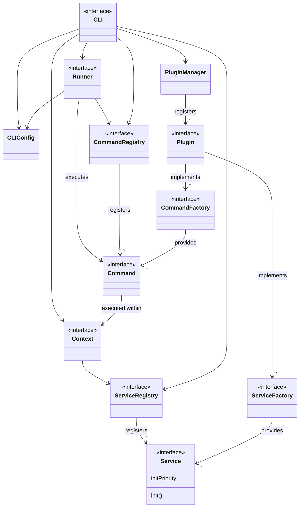
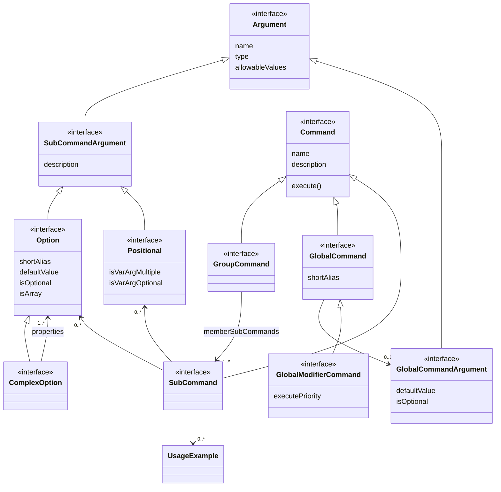
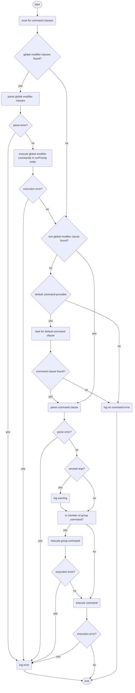
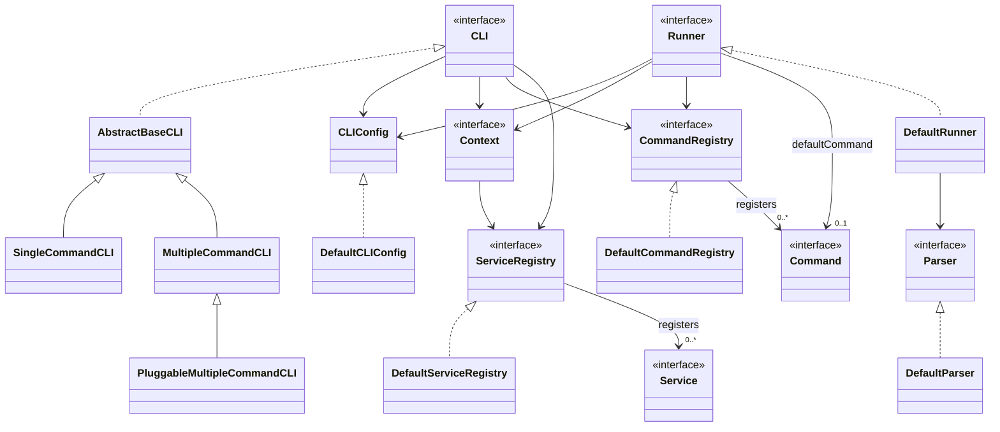

# dynamic-cli-framework

> A framework for developing CLI applications which support dynamic discovery
> and installation of new commands.

[//]: # (TODO: split out API for plugin developers)
[//]: # (TODO: update docs to ServiceProvider)
[//]: # (TODO: update docs to servicePriority from initPriority)

## Key Features

- Flexible CLI definitions:
  - single default global command with global arguments e.g.
    `executable [global_arguments]`
  - multiple sub-commands with sub-command based arguments e.g.
    `executable <sub_command> [sub_command_arguments]`
  - multiple grouped member sub-commands with member sub-command based arguments
    e.g.
    `executable <group_command> <member_sub_command> [member_sub_command_arguments]`
  - A mix of the above!
- Support for both named option and position based arguments e.g.
  `executable --<option_name>=<option_value> <positional_value>`
- Support for specifying multiple values for:
  - named options arguments via either:
    - implicitly indexed repeated arguments e.g.
      `executable --<option_name>=<option_value_1> --<option_name>=<option_value_2>`
    - or explicitly indexed arguments e.g.
      `executable --<option_name>[0]=<option_value_1> --<option_name>[1]=<option_value_2>`
  - position based arguments ("varargs") e.g.
    `executable <positional_1_value_1> <positional_1_value_2>`
- Support for complex nested options e.g.
  `executable --<option_name>.<property_1_name>=<property_1_value> --<option_name>.<property_1>.<property_1_a>=<property_1_a_value>`
- Core (but optional) commands for help, logging level, version management and
  plugin management.
- Core (but optional) services for colour output to stdout and stderr and
  configuration management.
- Core (but optional) support for dynamic discovery and installation of commands
  and services using
  [dynamic-plugin-framework](https://github.com/flowscripter/dynamic-plugin-framework)
- Minimal dependencies.
- Support for persisted configuration and environment variables to specify
  command argument defaults.
- ES2015 module based.
- Written in Typescript.

## Key Concepts

The key concepts are:

- All functionality is implemented within one or more `Command` instances.
- The `CLI` is responsible for:
  - maintaining a `CommandRegistry` and ensuring the `Command` instances it has
    registered are available to a `Runner`.
  - providing invocation arguments to the `Runner` which parses them and
    determines which `Command` to execute.
  - maintaining a `ServiceRegistry` and ensuring the `Service` instances it has
    registered are available in a `Context`.
  - executing the specified `Command` providing it with the parsed arguments and
    a `Context`.
- Dynamic plugins (enabled by
  [dynamic-plugin-framework](https://github.com/flowscripter/dynamic-plugin-framework))
  are used to allow:
  - dynamic load and import of one or more `CommandFactory` implementations
    providing one or more `Command` implementations.
  - dynamic load and import of one or more `ServiceFactory` implementations
    providing one or more `Service` implementations.

The following high level class diagram illustrates these relationships:

```mermaid
classDiagram
    class CLI {
        <<interface>>
    }

    class CLIConfig {
    }

    class Command {
        <<interface>>
    }

    class Service {
        <<interface>>
        initPriority
        init()
    }

    class Context {
        <<interface>>
    }

    class Runner {
        <<interface>>
    }

    class CommandRegistry {
        <<interface>>
    }

    class ServiceRegistry {
        <<interface>>
    }

    Runner --> CommandRegistry

    CLI --> CommandRegistry

    class PluginManager {
    }
    
    class Plugin {
        <<interface>>
    }

    CLI --> CLIConfig

    CLI --> Context

    Runner --> CLIConfig

    CLI --> Runner

    CLI --> PluginManager

    class ServiceFactory {
        <<interface>>
    }

    class CommandFactory {
        <<interface>>
    }

    Runner --> Command : executes

    Context --> ServiceRegistry

    CommandRegistry --> "*" Command : registers

    CLI-->ServiceRegistry
    
    ServiceRegistry --> "*" Service : registers
    
    Command --> Context : executed within
        
    PluginManager --> "*" Plugin : registers

    Plugin --> "*" CommandFactory: implements

    Plugin --> "*" ServiceFactory: implements
 
    CommandFactory --> "*" Command : provides
    
    ServiceFactory --> "*" Service : provides
```

### Commands

A `Command` declares:

- a `name` which is to be used in command line arguments to invoke it.
- the arguments it supports in an `argumentDefinitions` array.
- a function `execute()` which is invoked if the command is specified. This
  function is invoked with the parsed arguments and a context.

The sub-types of command are: `GlobalCommand`, `GlobalModifierCommand`,
`SubCommand` and `GroupCommand`.

The following diagram provides an overview of the Command API:

```mermaid
classDiagram
    class Argument {
        <<interface>>
        name
        type
        allowableValues
    }

    class SubCommandArgument {
        description
        <<interface>>
    }

    class Option {
        <<interface>>
        shortAlias
        defaultValue
        isOptional
        isArray
    }

    class Positional {
        <<interface>>
        isVarArgMultiple
        isVarArgOptional
    }

    class ComplexOption {
        <<interface>>
    }

    class GlobalCommandArgument {
        <<interface>>
        defaultValue
        isOptional
    }

    class GroupCommand {
        <<interface>>
    }

    class SubCommand {
        <<interface>>
    }

    class GlobalCommand {
        <<interface>>
        shortAlias
    }

    class GroupCommand {
        <<interface>>
    }

    class Command {
        <<interface>>
        name
        description
        execute()
    }

    class GlobalModifierCommand {
        <<interface>>
        executePriority
    }

    class UsageExample {
    }

    Argument <|-- SubCommandArgument

    Argument <|-- GlobalCommandArgument
    
    SubCommandArgument <|-- Option

    SubCommandArgument <|-- Positional
    
    Option <|-- ComplexOption

    Option "1..*" <-- ComplexOption : properties

    Command <|-- GroupCommand
    
    Option "0..*" <-- SubCommand

    Positional "0..*" <-- SubCommand

    Command <|-- GlobalCommand 
    
    Command <|-- SubCommand 
    
    GroupCommand --> "1..*" SubCommand : memberSubCommands  
    
    GlobalCommand --> "0..1" GlobalCommandArgument

    GlobalCommand <|-- GlobalModifierCommand 
    
    SubCommand --> "0..*" UsageExample
```

#### Global Command

A `GlobalCommand` provides the ability to invoke functionality via a global
argument and one optional value:

    executable --<global_command>[=<value>]

Some concrete examples:

    myNetworkApp --help=connect

A `GlobalCommand` also supports a short character alias:

    executable -<global_command_short_alias>[=<value>]

Some concrete examples:

    myNetworkApp -h=connect

#### Global Modifier Commands

Any number of `GlobalModifierCommand` instances can be specified as long as they
are accompanied by a `GlobalCommand`, `GroupCommand` or `SubCommand`:

    executable --<global_modifier_command_1> [global_modifier_command_1_arguments] \
               --<global_modifier_command_2> [global_modifier_command_2_arguments] \
               <global_command>[=<value>]

Each `GlobalModifierCommand` will be executed before the single specified
`GlobalCommand`, `SubCommand` or `GroupCommand` is executed. This behaviour
allows `GlobalModifierCommands` to modify the context in which later commands
execute.

A `GlobalModifierCommand` defines an "execution priority" which is used to
determine the order of execution when multiple `GlobalModifierCommands` are
specified.

A concrete example:

    myNetworkApp --loglevel=debug --config=config.json --help

where:

- `loglevel` is a `GlobalModifierCommand` with a value of `debug`
- `config` is a `GlobalModifierCommand` with a value of `config.json`
- `help` is a `GlobalCommand`.

#### Sub-Command

A `SubCommand` provides the ability to invoke functionality via specifying the
command name followed by any number of option and positional arguments.

A sub-command is invoked as follows:

    executable <sub_command> [sub_command_arguments]

A concrete example:

    myNetworkApp serve --host=localhost

#### Group Command

A `GroupCommand` allows multiple member `SubCommand` instances to be grouped
under a single named group. The name of the `GroupCommand` is specified before
the desired member `SubCommand` in one of two ways:

    executable <group_command> <member_sub_command> [member_sub_command_arguments]
    executable <group_command>:<member_sub_command> [member_sub_command_arguments]

Some concrete examples:

    myNetworkApp utils ping --host=localhost
    myNetworkApp utils:ping --host=localhost

**NOTE**: A `GroupCommand` also provides for it's own logic to be invoked BEFORE
the specified sub-command. However, a `GroupCommand` does not support any
arguments itself (apart from the member `SubCommand` name and its arguments).

### Arguments

#### Global Command and Global Modifier Command Arguments

`GlobalCommand` and `GlobalModifierCommand` instances support the definition of
a single `GlobalCommandArgument` consisting of:

- a type of either: `NUMBER`, `INTEGER`, `BOOLEAN`, `STRING`.
- an optional set of allowable values.
- an optional default value.
- whether the value is mandatory.

There are four ways in which these argument values can be specified:

    executable --<global_command>=<value>
    executable --<global_command> <value>
    executable -<global_command_short_alias>=<value>
    executable -<global_command_short_alias> <value>

Some concrete examples:

    myNetworkApp --help=connect
    myNetworkApp --help connect
    myNetworkApp -h=connect
    myNetworkApp -h connect

###### Boolean Values

For boolean options, specifying the value as `true` is not required. All of the
following set the value to `true`:

    executable --<global_command>=true
    executable --<global_command> true
    executable --<global_command>
    executable -<global_command_short_alias>=true
    executable -<global_command_short_alias> true
    executable -<global_command_short_alias>

#### Sub-Command Arguments

Arguments for a `SubCommand` can take two forms: `Option` or `Positional`.

Common to both are the following features:

- a name which must consist of alphanumeric non-whitespace ASCII characters or
  `_` and `-` characters. It cannot start with `-`.
- a type of either: `NUMBER`, `INTEGER`, `BOOLEAN` or `STRING`.
- an optional set of valid value choices.

##### Options

An `option` argument also provides for:

- a short character alias for the option.
- whether the option is mandatory.
- an optional default value.
- whether the option can be specified more than once (i.e. it is an array value)
- an additional type: `COMPLEX` which allows for nested arguments

There are four ways in which options can be specified:

    executable <sub_command> --<option_name>=<value>
    executable <sub_command> --<option_name> <value>
    executable <sub_command> -<option_short_alias>=<value>
    executable <sub_command> -<option_short_alias> <value>

###### Boolean Values

For boolean options, specifying the value as `true` is not required. All of the
following set the value to `true`:

    executable <sub_command> --<boolean_option_name>=true
    executable <sub_command> --<boolean_option_name> true
    executable <sub_command> --<boolean_option_name>
    executable <sub_command> -<boolean_option_short_alias>=true
    executable <sub_command> -<boolean_option_short_alias> true
    executable <sub_command> -<boolean_option_short_alias>

###### Array Options

For array options, multiple values can be specified using explicit indices:

    executable <sub_command> --<array_option_name>[index]=value --<array_option_name>[index]=value

or with implicit indices:

    executable <sub_command> --<array_option_name>=value --<array_option_name>=value

Some concrete examples:

    myNetworkApp --bind --interface[0]=eth0 --interface[1]=eth1
    myNetworkApp --bind --interface=eth0 --interface=eth1

**NOTE**: When using explicit indices, the indices may be specified in any
order, however specifying a sparse array is not supported:

    myNetworkApp --bind --interface[2]=eth0 --interface[1]=eth1 --interface[0]=eth2
    myNetworkApp --bind --interface[1]=eth0 --interface[2]=eth1 // invalid as index 0 is not specified

**NOTE**: Arrays of arrays are not supported:

    myNetworkApp --bind --interfaces[0][0]=eth0 // invalid as multi-dimensional arrays are not supported

###### Complex Options

For complex options, the path to the desired property is specified using a `.`
separator:

    executable <sub_command> --<parent_option_name>.<property_name>=<value> --<parent_option_name>.<property_name>.<sub-property-name>=<value>
    executable <sub_command> --<parent_option_name>.<property_short_alias>=<value> --<parent_option_short_alias>.<property_name>.<sub-property-name>=<value>

Mixed use of option names and short aliases is supported when specifying nested
complex option properties. As an example these would all be equivalent:

    --alpha.beta.gamma=1
    --alpha.b.gamma=1
    --alpha.b.g=1
    -a.beta.gamma=1
    -a.beta.g=1
    -a.b.g=1

Implicit and explicit array indexing is supported when specifying nested complex
option properties. However the implicit indexing is only applied to the last
nested property reference. As an example these would be equivalent:

    --foo.bar=1 --foo.bar=2
    --foo.bar[0]=1 --foo.bar[1]=2

If arrays of complex options need to be referenced then explicit indexing is
required. As an example:

    --foo[0].bar=1 --foo[1].bar=2

Some concrete examples:

    myNetworkApp --connect --address.host=127.0.0.1 --address.port=8080
    myNetworkApp --poll --address[0].host=127.0.0.1 --address[0].port=8080 --address[1].host=10.0.10.1 --address[1].port=443

##### Positionals

A `positional` argument is specified by a value which appears at the correct
position in the list of `SubCommand` arguments:

    executable <sub_command_name> <positional_1_value> <positional_2_value>

A concrete example:

    myHelloWorldApp say hello

where:

- `say` is a sub-command.
- `hello` is the value for the first positional argument.

###### Varargs Positionals

A `positional` argument also provides for "varargs" support (both optional and
multiple) which allows for zero, one or more entries:

**NOTE**: Only one "varargs" `positional` can be defined and it must be the last
positional expected for the command.

If "varargs" optional is set for `positional_1`, these are valid:

    executable <sub_command>
    executable <sub_command> <positional_1_value_1>

If "varargs" multiple is set for `positional_1`, these are valid:

    executable <sub_command> <positional_1_value_1>
    executable <sub_command> <positional_1_value_1> <positional_1_value_2>

If "varargs" optional AND multiple is set for `positional_1`, these are valid:

    executable <sub_command>
    executable <sub_command> <positional_1_value_1>
    executable <sub_command> <positional_1_value_1> <positional_1_value_2> <positional_1_value_3>

### Command Configuration

[//]: # (TODO: 8A - document configuration support for env vars and config file for services and commands)

#### Environment Variables

#### Configuration File

#### Configured Value Merging

The configured values are merged with parsed values before being validated based
on their associated argument definitions.

The following logic is applied during merging of configured and parsed values:

**Configured primitive values are used unless overridden by parsed values**

Example:

    configured: { foo: 'bar' }
    parsed:     { foo: 'bar1' }
    result:     { foo: 'bar1' }

**Configured complex values are merged with or overridden by parsed values**

Example:

    configured: { foo: { a: 1, b: 2 } }
    parsed:     { foo: { a: 3, c: 4 } }
    result:     { foo: { a: 1, b: 2, c: 4 } }

**Configured array values are merged with or overridden by parsed values**

Example:

    configured: { foo: [ 0, 1, 2, 3 ] }
    parsed:     { foo: [ 0, 4, 2 ] }
    result:     { foo: [ 0, 4, 2, 3 ] }

Example:

    configured: { foo: [ 0, 1, 2, 3 ] }
    parsed:     { foo: [ 0, undefined, 2 ] }
    result:     { foo: [ 0, 4, 2, 3 ] }

Example:

    configured: { foo: [ { a: 1 }, { a: 2 }, { a: 3 }, { a: 4 } ] }
    parsed:     { foo: [ { a: 5 }, undefined, { a: 6, b: 7 } ] }
    result:     { foo: [ { a: 5 }, { a: 2 }, { a: 6, b: 7 }, { a: 4 } ] }

### Value Validation

After parsing command line arguments and assigning values to relevant command
arguments (and merging with any pre-configured values), values are validated
based on the argument definitions.

The following scenarios produce validation errors:

- **Missing Value**: If an argument is not optional and no value has been
  provided.
- **Incorrect Value Type**: The value specified was not the correct type for the
  argument. e.g. `foo` cannot be provided for a boolean argument, nor for a
  complex object argument.
- **Illegal Multiple Values**: The argument does not support multiple values but
  multiple values have been provided.
- **Illegal Value**: If the argument defines possible allowable values and the
  value provided is not one of these.
- **Illegal Sparse Array**: If multiple values were specified using array
  indices and this resulted in empty entries in the array of values.
- **Unknown Property**: If the value provided is for a property which is not
  defined on a complex object argument.
- **Array Size Exceeded**: If there is an attempt set more than the maximum
  (255) number of values for an array option.
- **Nesting Depth Exceeded**: If there is an attempt specify a complex option
  property at a nesting depth more than the maximum (10).
- **Option Is Complex**: If the argument attempts to set a value on a complex
  option rather than on an option or a property of a complex option

## Command Execution

[//]: # (TODO: 8B - document Argument Values provided as valid and matching structure of defined options then positionals)

## Usage Examples

The following example projects are available:

- [example-cli](https://github.com/flowscripter/example-cli) is an example CLI
  application based on this framework.
- [example-cli-plugin](https://github.com/flowscripter/example-cli-plugin) is an
  example command and service plugin based on this framework.

## Implementation Details

### CLI

[//]: # (TODO: 8C - document AbstractBaseCLI logic flow and RunResult handling)

### Runner

Core CLI behaviour is provided by a `Runner` implementation which is responsible
for parsing arguments, determining which `Command` to execute and then executing
it.

The provided default `Runner` implementation (`DefaultRunner`) supports
specification of a default command which should be executed if no command names
are parsed on the command line. In this scenario, any arguments provided will be
parsed as possible arguments for the default command as well as potential
`GlobalModifierCommand` names.

[//]: # (TODO: 8D - document default GlobalModifierCommands and add to flowchart)

The following activity diagram illustrates the `DefaultRunner` logic:

```mermaid
flowchart TD
    A([start])

    B(scan for command clauses)

    C{global modifier clauses found?}

    D(parse global modifier clauses)

    E{parse error?}

    F(log error)

    G(execute global modifier commands in runPriority order)

    H{execution error?}

    Ha{default command provided}

    I{non-global modifier clause found?}

    J(look for default command clause)

    K{command clause found?}

    L(log no command error)

    M(parse command clause)

    N{parse error?}

    O{unused args?}

    P(log warning)

    Q(is member of group command?)
    
    Q1(execute group command)

    Q2(execute command)

    Q3{execution error?}
    
    R{execution error?}

    S([end])

    A --> B
    
    B --> C
    
    C --> |yes|D
    
    D --> E
    
    E --> |no|G

    H --> |no|I

    E --> |yes|F
    
    F --> S

    C --> |no|I
    
    G --> H
    
    H --> |yes|F
    
    I --> |no|Ha
    
    Ha --> |yes|J

    J --> K
    
    K --> |no|L
    
    Ha --> |no|L

    K --> |yes|M

    I --> |yes|M
    
    M --> N
    
    N --> |yes|F
    
    N --> |no|O
    
    O --> |yes|P
    
    P --> Q

    Q3 --> |no|Q2

    Q --> |no|Q2

    Q --> |yes|Q1

    Q1 --> Q3

    Q3 --> |yes|F

    O --> |no|Q

    Q2 --> R

    R --> |yes|F     

    R --> |no|S

    L --> S
```

### Parser

The `Runner` defers to a `Parser` implementation which performs the actual
argument parsing.

The following parsing rules apply for the provided `DefaultParser`
implementation:

**Arguments Must Follow Command**

All arguments for a command are expected to FOLLOW the command i.e. this is
**NOT** valid:

    executable <sub_command_argument> <sub_command> // not valid

**Arbitrary Option Order**

The order of options for a particular command is not important i.e. these are
equivalent:

    executable <sub_command> --<option_1_name> <option_1_value> --<option_2_name> <option_2_value>
    executable <sub_command> --<option_2_name> <option_2_value> --<option_1_name> <option_1_value>

**Arbitrary Command Order**

The order of commands is not important i.e. these are equivalent:

    executable <sub_command> [sub_command_arguments] --<modifier_command_1> [modifier_command_1_arguments] \
               --<modifier_command_2> [modifier_command_2_arguments]
    executable --<modifier_command_1> [modifier_command_1_arguments] <sub_command> [sub_command_arguments] \
               --<modifier_command_2> [modifier_command_2_arguments]

**No Command Interleaving**

Arguments for commands cannot be interleaved with other commands i.e. this is
**NOT** valid:

    executable --<modifier_command> <sub_command> [sub_command_arguments] [modifier_command_arguments] // not valid

**Single Command**

Apart from global modifier commands, there is expected to be only one command
specified i.e. these will **NOT** work as intended:

    // not valid - sub-command 2 and arguments will be treated as trailing arguments of sub-command 1.
    executable <sub_command_1> [sub_command_1_arguments] <sub_command_2> [sub_command_2_arguments] 

    // not valid - sub-command and arguments will be treated as trailing arguments of global command.
    executable --<global_command> <sub_command> [sub_command_arguments]

**Group Command**

A group command name must always be following immediately by a container
sub-command name i.e. these are **NOT** valid:

    executable <member_sub_command> <group_command> // not valid
    executable <group_command> <global_command> <member_sub_command> // not valid

**Unused Leading and Trailing Arguments**

Any leading arguments which appear BEFORE an identified command name are
retained. Any trailing arguments which appear after an identified name which are
not consumed when parsing the command arguments are also retained.

Once a command has been identified and parsed any retained arguments are
considered unused and a warning is output.

If a command is NOT identified, any retained arguments are considered potential
arguments for a default command if it has been configured. This behaviour means
the following are all equivalent:

    executable <default_command_argument> --<modifier_command_name> <modifier_command_argument>
    executable --<modifier_command_name> <modifier_command_argument> <default_command_argument>
    executable --<modifier_command_1_name> <modifier_command_1_argument> <default_command_argument> \
               --<modifier_command_2_name> <modifier_command_2_argument>

### Core Services

[//]: # (TODO: 8E - document Lifecycle, Configuration, DefaultConfiguration and ConfigurationService)
[//]: # (TODO: 8F - document Printer, DefaultPrinter and PrinterService)

### Core Commands

[//]: # (TODO: 8G - document Core Commands: ...)

## API

API docs for the library:

[API Documentation](https://doc.deno.land/https://deno.land/x/flowscripter_dynamic_cli_framework/mod.ts)

## Development

Test: `deno test -A --unstable`

Lint: `deno fmt`

The following diagram provides an overview of the main internal classes:

```mermaid
classDiagram

    class Context {
        <<interface>>
    }

    class CLI {
        <<interface>>
    }

    class Runner {
        <<interface>>
    }

    class Parser {
        <<interface>>
    }

    class AbstractBaseCLI {
    }

    class DefaultRunner {
    }

    class DefaultParser {
    }

    class DefaultCommandRegistry {
    }

    class DefaultServiceRegistry {
    }

    class Command {
        <<interface>>
    }

    class Service {
        <<interface>>
    }

    class CommandRegistry {
        <<interface>>
    }

    class ServiceRegistry {
        <<interface>>
    }

    class CLIConfig {
    }

    class DefaultCLIConfig {
    }

    class SingleCommandCLI {
    }

    class MultipleCommandCLI {
    }

    class PluggableMultipleCommandCLI {
    }

    CLI <|.. AbstractBaseCLI
    
    AbstractBaseCLI <|-- SingleCommandCLI

    AbstractBaseCLI <|-- MultipleCommandCLI

    MultipleCommandCLI <|-- PluggableMultipleCommandCLI

    CLIConfig <|.. DefaultCLIConfig

    Runner --> CLIConfig

    Runner --> Context

    Runner --> CommandRegistry

    Runner --> "0..1" Command : defaultCommand

    ServiceRegistry <|.. DefaultServiceRegistry
    
    ServiceRegistry --> "0..*" Service : registers

    CLI --> CLIConfig

    CLI --> Context

    DefaultRunner --> Parser

    Runner <|.. DefaultRunner
    
    Parser <|.. DefaultParser

    CLI --> CommandRegistry

    CLI --> ServiceRegistry

    CommandRegistry <|.. DefaultCommandRegistry

    CommandRegistry --> "0..*" Command : registers

    Context --> ServiceRegistry
```

### Debug Logging

Internal framework logging can be enabled by setting the `CLI_DEBUG` environment
variable. `AbstractBaseCLI` will detect this and define a default Deno
`ConsoleHandler` logger with `DEBUG` level which is used by internal
implementation classes such as `DefaultRunner` and `DefaultParser`.

### Command and Service Validation

By default commands and services that are built into the CLI or provided by
already installed plugins are not validated as they are loaded. The only
validation that takes place is for commands or services provided by plugins
BEFORE they are installed.

Runtime validation of all commands and services can be enabled by setting the
`CLI_VALIDATE_ALL` environment variable.

Command validation includes:

- ensuring multiple commands in the CLI do not have duplicate names or short
  aliases.
- command options for each command do not include duplicate names or short
  aliases.
- default values for options have the type specified by the option.
- default values for options match an allowable value if specified by the
  option.
- default array values for options are specified only for array options.
- command options for each command do not include duplicate names or short
  aliases.
- only the last positional for a command is defined as a vararg.
- default values for complex options matched the nested property hierarchy.
- paths to nested properties of complex options are unique.

## License

MIT © Flowscripter
