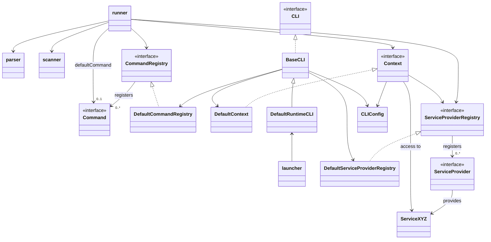
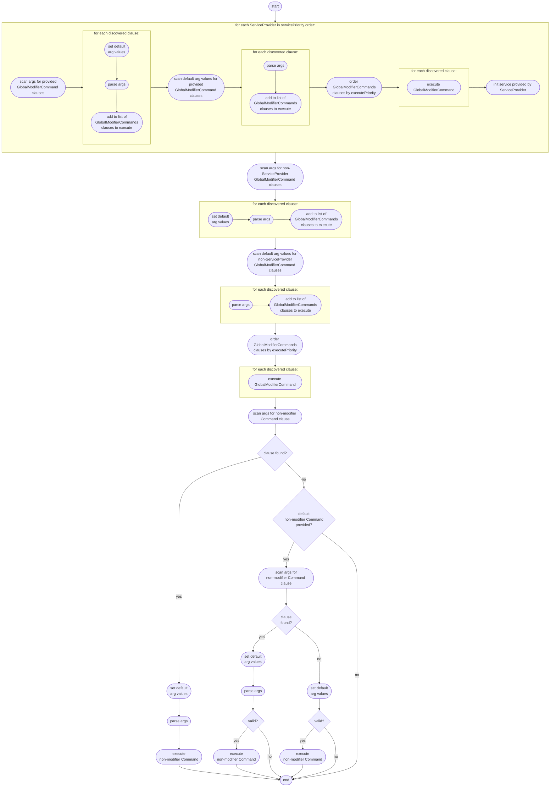

# Implementation

The following diagram provides an overview of the main internal modules and
classes:



### `launcher`

The standard way to make use of the framework is to import `launcher` and use
one of the two helper functions it provides:

- `launchSingleCommandCLI`
- `launchMultiCommandCLI`

These allow a CLI implementor to specify `Command` instances to use together
with basic CLI details such as name and description.

### `CLI`

The `CLI` interface has the simple responsibility of taking a `CLIConfig` and a
list of user specified command line arguments which it should then parse and
execute any valid specified `Command` it discovers.

#### `BaseCLI`

The `BaseCLI` class provides a base implementation of the `CLI` interface which
supports both single command and multiple sub-command CLI scenarios. It provides
the ability to add any number of `Command` and `ServiceProvider` instances.

If only one command is provided, `BaseCLI` will operate as a single command CLI
and the provided command will be set as a default command. If more than one
command is added, `BaseCLI` will operate as a multi-command CLI. In this case
the default command will be set to a help command. In the case of no command
being specified or a parse error occurring, appropriate help will be displayed.

By default the `BaseCLI` adds the following `ServiceProvider` implementations
(these are documented in further detail below):

- `ShutdownServiceProvider` allowing CLI shutdown hooks to be registered.
- `ConfigurationServiceProvider` allowing argument value defaults to be loaded
  from a configuration file or environment variables. This also provides a
  key-value store service.
- `PrinterServiceProvider` allowing CLI output to stdout and stderr writable
  streams.

By default the `BaseCLI` adds the following `Command` implementations (these are
documented in further detail below):

- Appropriate help commands depending on whether the CLI is configured with a
  single command or multiple sub-command.
- commands provided by the `ConfigurationServiceProvider`.
- commands provided by the `PrinterServiceProvider`.
- `VersionCommand`

#### `DefaultRuntimeCLI`

`DefaultRuntimeCLI` is a simple extension to `BaseCLI` which uses NodeJS
specific APIs to access the command line arguments, stdout and stderr streams
and to exit the process.

### `runner`

Core CLI behaviour is provided by a `runner` implementation which is responsible
for parsing arguments, determining which `Command` instances to execute and then
executing them.

The `runner` implementation supports specification of a default command which
should be executed if no command names are parsed on the command line. In this
scenario, any arguments provided will also be parsed as possible arguments for
the default command.

The logic for the `runner` is somewhat complex as it allows for the prioritised
execution of `GlobalModifierCommand` instances and the prioritised
initialisation of `ServiceProvider` instances. One reason for this is to allow
the `ConfigurationServiceProvider` to be initialised first and for the resulting
configuration to be available to other `ServiceProvider` instances which are yet
to be initialised.

The following activity diagram illustrates the `runner` logic:



### `scanner`

The `runner` defers to a `scanner` implementation which scans arguments for
potential `CommandClause` instances e.g. a `Command.name` followed by potential
arguments for that command..

### `parser`

The `runner` defers to a `parser` implementation which performs the actual
argument parsing based on the `CommandClause` instances returned from the
`scanner`.

The following parsing rules apply:

**Arguments Must Follow Command**

All arguments for a command are expected to FOLLOW the command i.e. this is
**NOT** valid:

    executable <sub_command_argument> <sub_command> // not valid

**Arbitrary Option Order**

The order of options for a particular command is not important i.e. these are
equivalent:

    executable <sub_command> --<option_1_name> <option_1_value> --<option_2_name> <option_2_value>
    executable <sub_command> --<option_2_name> <option_2_value> --<option_1_name> <option_1_value>

**Arbitrary Command Order**

The order of commands is not important i.e. these are equivalent:

    executable <sub_command> [sub_command_arguments] --<modifier_command_1> [modifier_command_1_arguments] \
               --<modifier_command_2> [modifier_command_2_arguments]
    executable --<modifier_command_1> [modifier_command_1_arguments] <sub_command> [sub_command_arguments] \
               --<modifier_command_2> [modifier_command_2_arguments]

**No Command Interleaving**

Arguments for commands cannot be interleaved with other commands i.e. this is
**NOT** valid:

    executable --<modifier_command> <sub_command> [sub_command_arguments] [modifier_command_arguments] // not valid

**Single Command**

Apart from global modifier commands, there is expected to be only one command
specified i.e. these will **NOT** work as intended:

    // not valid - sub-command 2 and arguments will be treated as trailing arguments of sub-command 1.
    executable <sub_command_1> [sub_command_1_arguments] <sub_command_2> [sub_command_2_arguments] 

    // not valid - sub-command and arguments will be treated as trailing arguments of global command.
    executable --<global_command> <sub_command> [sub_command_arguments]

**Group Command**

A group command name must always be following immediately by a container
sub-command name i.e. these are **NOT** valid:

    executable <member_sub_command> <group_command> // not valid
    executable <group_command> <global_command> <member_sub_command> // not valid

**Unused Leading and Trailing Arguments**

Any leading arguments which appear BEFORE an identified command name are
retained. Any trailing arguments which appear after an identified name which are
not consumed when parsing the command arguments are also retained.

Once a command has been identified and parsed any retained arguments are
considered unused and a warning is output.

If a command is NOT identified, any retained arguments are considered potential
arguments for a default command if it has been configured. This behaviour means
the following are equivalent:

    executable <default_command_argument> --<modifier_command_name> <modifier_command_argument>
    executable --<modifier_command_name> <modifier_command_argument> <default_command_argument>

### Command Execution

A `Command` is executed via the implemented function:

    execute(argumentValues: ArgumentValues, context: Context): Promise<void>;

The `Context` instance allow access to the `CLIConfig` and the ability to access
services by registered service IDs.

The `ArgumentValues` instance provides access to the populated and validated
arguments for the command. These values are provided either:

- as a single key-value pair in the form `commandName: globalArgumentValue` for
  a `GlobalCommand` or a `GlobalModifierCommand`.
- as a complex nested key-value structure mirroring the defined `Option` and
  `Positional` instances of a `SubCommand`

As an example, if a `GlobalModifierCommand` is defined as follows:

```
const globalModifierCommand: GlobalModifierCommand = {
  name: "log-level",
  argument: {
    name: "level",
    type: ArgumentValueTypeName.STRING,
  },
  executePriority: 1,
  execute: (argumentValues: ArgumentValues, context: Context) => Promise.resolve()
};
```

and a `SubCommand` is defined as follows:

```
const subCommand: SubCommand = {
  name: "connect",
  options: [
    {
      name: "address",
      type: ComplexValueTypeName.COMPLEX,
      properties: [
        {
          name: "host",
          type: ArgumentValueTypeName.STRING
        },
        {
          name: "port",
          type: ArgumentValueTypeName.NUMBER
        }
      ]
    }
  ],
  positionals: [
    {
      name: "retryOnError",
      type: ArgumentValueTypeName.BOOLEAN
    }
  ],
  execute: (argumentValues: ArgumentValues, context: Context) => Promise.resolve()
};
```

when the following command line arguments are specified:

`myNetworkApp --connect --address.host=127.0.0.1 --address.port=8080 true --log-level=DEBUG`

then the `ArgumentValues` passed to the `globalModifierCommand.execute(...)`
function would be:

```
{
  "log-level": "DEBUG"
}
```

and the `ArgumentValues` passed to the `subCommand.execute(...)` function would
be:

```
{
  address: {
    host: "127.0.0.1",
    port: 8080
  },
  retryOnError: true
}
```